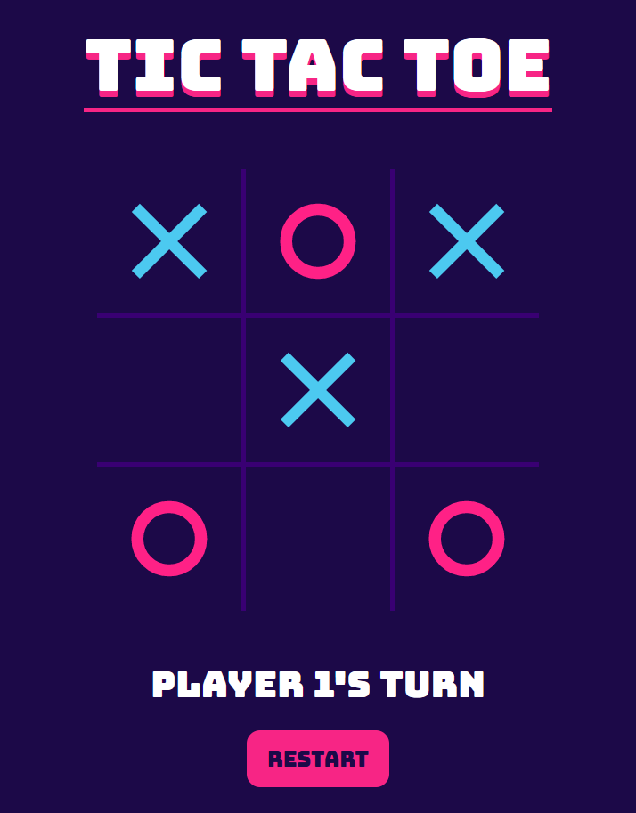

# Tic Tac Toe

### Featuring mobile-support ❤

A neat little Tic Tac Toe game for [TOP](https://www.theodinproject.com/)!
This project was mainly focused on using factory functions and the module pattern (dog balls) in JavaScript.

My main ( personal ) objectives in this task were, again, to keep practicing my planning and pseudocode skills.
To accomplish this, once again, I created a design via the use of Figma and drew diagrams for this project.

## Learning Outcomes

- Use JS Factory Functions and the Module Pattern to organize code
- Separation of DOM from internal logic ( as much as possible! )
- Logical planning for progression of game
- Functional & fashionable UI / UX

### Credits ❤

Google Fonts for the <a href="https://fonts.google.com/specimen/Bungee">Bungee</a> font.
